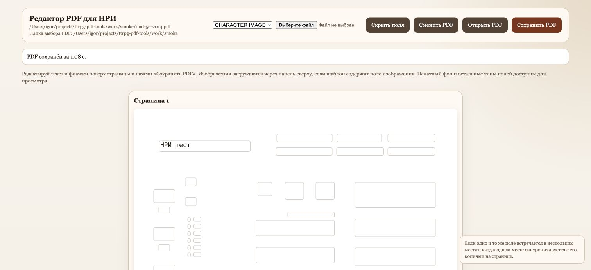

# ttrpg-pdf-tools

Инструменты для PDF настольных ролевых игр (НРИ): заполнение листов персонажей, подбор размера текста, вставка изображений и подготовка копий для iPhone/iPad. Общее ядро работает с полями PDF; особенности Pathfinder 2e и локализованных D&D-листов определяются по содержимому шаблона.

PDF хранит значения в видимых полях страницы (widgets) и в структуре `AcroForm /Fields`. Редактор обновляет оба слоя, чтобы значения и флажки сохранялись при повторном открытии в разных просмотрщиках.

## Быстрый запуск

Нужны Python 3.10+ и `uv`. Открытие браузера через `--open-browser` рассчитано на macOS с Google Chrome; на другой системе открой показанный локальный URL вручную.

```bash
git clone https://github.com/chupakobra6/ttrpg-pdf-tools.git
cd ttrpg-pdf-tools
uv sync --locked

# Работай с копией, сохраняя исходный шаблон.
cp templates/pathfinder-2e/RM_CharacterSheet_Fillable.pdf templates/local/my-character.pdf
uv run python scripts/pdf_form_web_editor.py templates/local/my-character.pdf --open-browser
```

Редактируй текст и флажки поверх страниц, затем нажми **Сохранить PDF**. Подбор размера заполненного текста выполняется при каждом сохранении. Кнопка **Сменить PDF** открывает выбор файлов из `templates/local/`; другой корень задаётся через `--picker-dir /path/to/folder`. Кнопка **Открыть PDF** показывает текущий файл в Chrome. Клавиша `f` и кнопка **Скрыть поля** переключают видимость полей поверх страницы.

Изображения загружаются через панель сверху, если PDF содержит button/image-поля. При нескольких полях выбери нужное в списке. Печатный фон, списки, радиокнопки и подписи доступны для просмотра; редактор не предлагает их как изменяемый текст. PDF без полей можно просматривать и готовить к доставке, но заполнять его печатный фон этим инструментом нельзя.

После установки среду не нужно активировать вручную: команды запускаются через `uv run`. Если среда повреждена, пересоздай `.venv` командой `uv venv --clear`, затем выполни `uv sync --locked`. Зависимости и их версии хранятся в `pyproject.toml` и `uv.lock`; при их изменении обновляй оба файла через `uv lock`.

## Каталоги

| Путь | Содержимое |
| --- | --- |
| `scripts/` | Общее ядро, CLI, web-редактор и подготовка доставки |
| `tests/` | Проверки форм, сохранения, конфликтов и доставки |
| `templates/pathfinder-2e/` | Листы и памятки Pathfinder 2e |
| `templates/dnd-5e-2014/` | Русский заполняемый лист D&D 5e 2014 |
| `templates/dnd-5e-2024/` | Русский заполняемый лист D&D 2024 |
| `templates/homebrew/` | Авторские и адаптированные справочные материалы |
| `templates/local/` | Личные шаблоны, заполненные листы и рабочие копии; исключены из Git |
| `docs/images/` | Иллюстрации редактора и результата |
| `work/` | Временные проверки и рендеры; исключены из Git |

Публичные PDF входят в репозиторий как исходные материалы. При добавлении другой системы используй `templates/<система>/`. Частные материалы остаются в `templates/local/`, включая вложенные каталоги. Заполненный лист не заменяет исходный шаблон; личные листы и `.venv/` не коммитятся.

## Шаблоны и профили

| Система | Заполняемый оригинал | Поддержка |
| --- | --- | --- |
| Pathfinder 2e | `templates/pathfinder-2e/RM_CharacterSheet_Fillable.pdf` | Текст, флажки, подбор размера и выравнивание компактных числовых строк |
| D&D 5e 2014 RU | `templates/dnd-5e-2014/DnD_5E_CharacterSheet_Form_Fillable_ru.pdf` | Текст, флажки, изображения `CHARACTER IMAGE` и `Faction Symbol Image`; сопоставление навыков с печатными строками |
| D&D 2024 RU | `templates/dnd-5e-2024/DnD_2024_Character-Sheet-Fillable-RUS.pdf` | Текст, флажки и сопоставление навыков; поля изображений в этом шаблоне отсутствуют |

В Pathfinder-каталоге также сохранены `RM_CharacterSheetRus.pdf`, `CharacterSheetRus_A5.pdf`, `Воин.pdf`, `action_sheet_RUS v1.4.1 center.pdf`, `actions_sheet_by_vetal.pdf`, `conditions.pdf`, `conditions_1.0_center.pdf` и `pathfinder sheet 1.0.pdf`. В `homebrew/` находится `Хоубрю по драгонаге.pdf`. Эти исходники сохраняют имена и содержимое; справочный PDF не обязательно содержит редактируемые поля.

Другие НРИ используют то же ядро для текстовых полей, флажков и обнаруженных полей изображений. Наличие полей позволяет начать работу, но совместимость конкретного шаблона нужно подтвердить чтением сохранённых значений и просмотром страниц. Профили навыков применяются только к распознанным D&D-шаблонам.

## Программное заполнение

`PdfFormEditor` изменяет значения полей, синхронизирует widgets и `AcroForm /Fields`, вставляет изображения и подбирает размер текста.

```python
from pathlib import Path
from scripts.pdf_form_editor import PdfFormEditor

editor = PdfFormEditor(Path("templates/local/my-character.pdf"))
try:
    editor.set_text("ancestry_name", "Человек")  # Pathfinder 2e
    editor.set_checkbox("skill_athletics_prof_e", True)
    editor.autosize_text_fields("filled")
    editor.save()
finally:
    editor.close()
```

В D&D 2014 внутренние имена навыков не совпадают с русскими печатными строками. В D&D 2024 поля имеют технические имена вроде `text_69srmm` и `checkbox_128cefr`. Для этих шаблонов используй логические имена навыков:

```python
editor.set_skill_values({
    "Perception": "+4",
    "Intimidation": "+2",
    "Insight": "+4",
})
editor.set_skill_proficiencies({
    "Perception": True,
    "Intimidation": True,
    "Insight": True,
})
```

Для обращения к фактическому имени поля используй `raw:`, например `raw:Performance` в D&D 2014 или `raw:text_69srmm` в D&D 2024. `list_fields()` возвращает фактические поля с их собственными значениями. Web-редактор сохраняет эти имена напрямую, без повторного сопоставления навыков.

Перед записью неподдерживаемая PDF-пунктуация нормализуется: фигурные кавычки, длинные тире и маркеры заменяются безопасными ASCII-символами. Это не заменяет проверку отображения кириллицы и других символов в выбранном шаблоне.

## Подбор размера текста

`pdf_form_tool.py` подбирает размеры текста, сохраняя значения и состояния флажков. Сначала проверяй результат на временной копии.

```bash
uv run python scripts/pdf_form_tool.py templates/local/my-character.pdf

# Записать отдельную копию, в том числе при отсутствии изменений размера.
uv run python scripts/pdf_form_tool.py templates/local/my-character.pdf --out-dir work/autosized

# Обрабатывать последующие сохранения одного файла.
uv run python scripts/pdf_form_tool.py templates/local/my-character.pdf --watch

# Следить за PDF непосредственно в указанном каталоге.
uv run python scripts/pdf_form_tool.py --watch-dir templates/local
```

Режимы `--autosize none|filled|all`: без подбора, только заполненные поля или все текстовые поля. По умолчанию выбран `filled`; web-редактор принимает тот же параметр. Обычный запуск и `--watch` меняют исходник, если не задан `--out-dir`. Для `--watch-dir` результаты по умолчанию находятся в `.autosized/` внутри указанного каталога; `--out-dir` меняет каталог результатов. Интервал наблюдения задаётся через `--watch-interval`.

## Финальная копия для игрока

После заполнения проверь редактируемый оригинал в Chrome или Acrobat-совместимом просмотрщике, затем запусти `pdf_delivery.py` на листе и нужных памятках:

```bash
uv run python scripts/pdf_delivery.py templates/local/my-character.pdf

# Несколько готовых PDF; отправка нужна только по поручению пользователя.
uv run python scripts/pdf_delivery.py \
  /path/to/character-sheet.pdf \
  /path/to/player-reference.pdf \
  --send-saved
```

Команда сохраняет редактируемые исходники и создаёт `*_iPhone_iPad.pdf` в `iphone-ipad/` рядом с каждым из них. Пробелы и дефисы в имени результата заменяются подчёркиваниями. Для общего каталога используй `--out-dir /path/to/output`.

Профиль доставки фиксирован: 300 DPI, JPEG quality 92. Проверка требует исходную геометрию страниц и по одному непрозрачному изображению DeviceRGB на страницу. Формы, PDF-шрифты, выделяемый текст, прозрачность и annotations в результате отсутствуют; JPEG проверяется на размеры и допустимую потерю качества. Результат не заменяет редактируемую форму. По умолчанию игроку передаётся копия для iPhone/iPad; исходная форма передаётся по явной просьбе.

`--send-saved` вызывает `main send-saved` из соседнего проекта Telegram Harvest и отправляет только в Saved Messages аккаунта `@Pheik13`. Отправка считается проверенной после чтения сообщения и сверки имени файла, MIME `application/pdf` и размера в байтах. Если helper недоступен, подготовленную копию можно использовать локально. `--caption` задаёт подпись только для одного входного PDF. Правила helper находятся в `../telegram-harvest/AGENTS.md`.

## Сохранение при параллельных правках

`PdfFormEditor` читает поля и версию из одного снимка PDF. Перед записью web-редактор и CLI через `pdf_file_state` сверяют содержимое и идентичность исходника. Изменение, удаление или замена файла по прежнему пути отменяет устаревшую запись. Web-форма дополнительно привязана к файлу, ревизии и сессии сервера: запрос после переключения файла, сохранения другой вкладкой или перезапуска получает HTTP 409.

При отказе web-редактор показывает несохранённые значения и предлагает скачать весь ввод с изображениями в `pdf-unsaved-draft.json`. Поля находятся в `values`, изображения в `files_base64`; отсутствующий флажок означает снятый. Открой актуальный PDF в новой вкладке, сравни правки и перенеси нужные. Страницу с черновиком оставь открытой до завершения. При программном `FileConflict` объект `PdfFormEditor` сохраняет изменения в памяти: прочитай их до `close()` и сопоставь со свежим файлом.

Сохранение и экспорт готовят и проверяют временный файл до атомарной замены. Экспорт рендерит тот же снимок, который проходит проверку версии. Изменение исходника или прежней копии до публикации, отмена либо ошибка подготовки/записи оставляет прежний результат. Временные файлы удаляются после успеха или отказа; внезапное завершение процесса может оставить собственный временный файл, но не частично записанный результат.

Процессы инструментов согласуют проверку и замену через `flock` по каноническому пути. Файлы блокировки находятся в `~/.cache/ttrpg-pdf-tools/locks`; не удаляй их во время работы, поскольку ожидающий процесс может удерживать прежний inode. Блокировки не требуют записи рядом с исходником: экспорт поддерживает каталог источника только для чтения. Чтение и рендер снимка не удерживают блокировку на весь экспорт; перед публикацией версия проверяется снова.

Сторонний редактор может игнорировать `flock`. Изменение до финальной проверки обнаруживается, но ОС не запрещает запись такого приложения между проверкой и заменой. Для полной защиты заверши редактирование сторонним приложением перед сохранением или экспортом. Успешный результат описывает опубликованные байты; последующие независимые изменения файла не входят в эту операцию.

## Проверка и диагностика

```bash
uv run python -m unittest discover -s tests
```

Проверяй два результата: значения и свойства сохранённой формы, затем вид страниц. Текст должен быть виден на странице, флажки должны отображаться, навыки должны попадать в нужные печатные строки, а изображение в выбранное поле. После существенной правки содержимого повтори подбор размера. Перед передачей PDF игроку запусти `pdf_delivery.py`: его проверки устраняют зависимость копии от нестандартных и невстроенных PDF-шрифтов.

macOS Preview может разрушить или свести форму в изображение при сохранении. Браузерный и IDE-просмотрщики используй для просмотра; правки записывай через инструменты проекта. Если IDE показывает ввод, а файл не меняется, просмотрщик не сохранил форму. Если значения есть в метаданных, но не видны, обработай копию через `PdfFormEditor` и подбор размера, затем проверь страницы. При ошибке первого запуска выполни `uv sync --locked`.

Для автоматических скриншотов доступна отдельная необязательная зависимость:

```bash
uv sync --extra screenshots
uv run playwright install chromium
```

## Примеры результата




